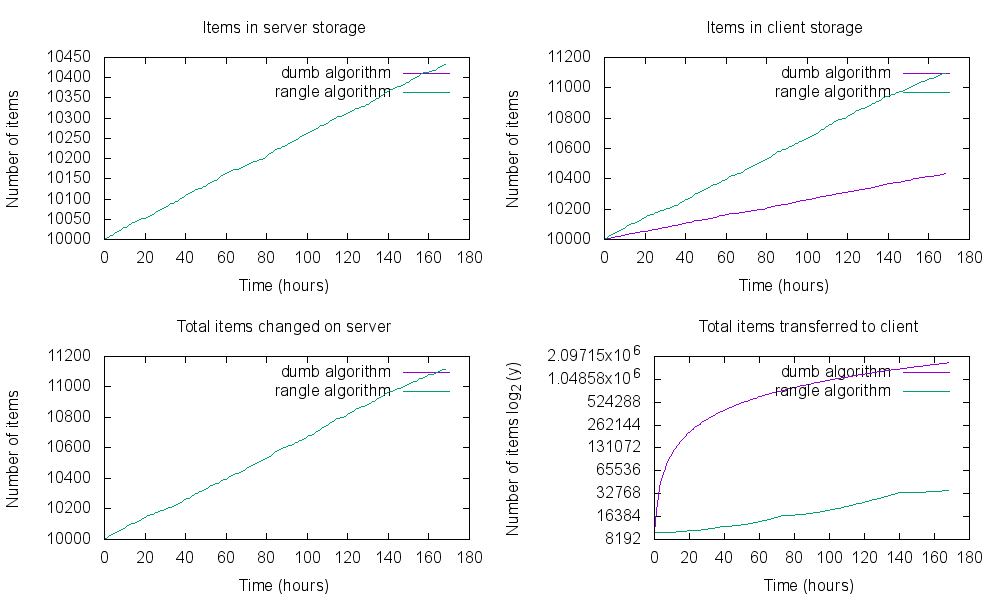

# rangle
## Range based chunk caching algorithm

### `Rangle.ranges(items, ranges, options)`

Given the items that are being cached and an array of the current ranges a client
has, returns a new list of ranges for the client to fetch. The ranges are chosen
to minimize amount of items the client needs to fetch, while at the same time not
allowing the client's excess storage to grow in an unbounded way.

- `maxClientChunks` - The maximum number of range chunks that should be given to the client. Beyond which point, existing chunks must be consolidated. Defaults to 5.
- `minValidChunkRatio` - For every chunk `items in server chunk/items in client chunk` is calculated. This is the `validChunkRatio`. If any of the chunks's value is lower than this option, the chunk is evicted and merged with a neighbouring chunk.

##### Example

```js
const ranges = [
    '0-10:2',
    '10-20:2',
    '20-30:3',  // validChunkRatio = 2/3 = 0.67 - should be merged with next chunk
    '30-40:2',
    '40-50:2'
];

const items = {
    1: { modified: 1 },
    2: { modified: 1 },
    3: { modified: 11 },
    4: { modified: 18 },
    5: { modified: 52 },
    6: { modified: 23 },
    7: { modified: 24 },
    8: { modified: 32 },
    9: { modified: 34 },
    10: { modified: 42 },
    11: { modified: 48 }
};

const newRanges = Rangle.ranges(items, ranges);
// ['0-10', '10-20', '20-40', '40-50', '50->']
```

`50->` means the range from `time === 50` to whatever the time is when the chunk is actually requested. This algorithm makes no assumption about the current time. Ranges are closed on the left and open on the right, i.e. `50->100` will not include any elements where `modified === 50` but may include elements where `modified === 100`.

### Eviction

When the client has the maximum number of chunks, two existing chunks will be merged based on the following logic:

- Starting from the oldest chunk, if any of the chunks `validChunkRatio` is below `minValidChunkRatio`, it will be merged with the next chunk, unless it is the final chunk, in which case it is merged with the previous chunk. Eviction process is finished.
- If the above doesn't yield a new space, the number of valid items is calculated for each chunk. The min contiguous subarray of 2 chunks is then chosen for eviction.

### Performance

The below is a simulation, starting with 10,000 items where between 0-2% of items are modified per day and there are between 20 and 100 new items added per day. The length of the simulation is 1 week. The client requests ranges every hour. Some metrics including total transfer and storage are compared with the dumb algorithm. The dumb algorithm simply hands the client the catch all range (`0->`) with every request.

*Note: The bottom-right chart is a log (base 2) plot in the y-axis*


